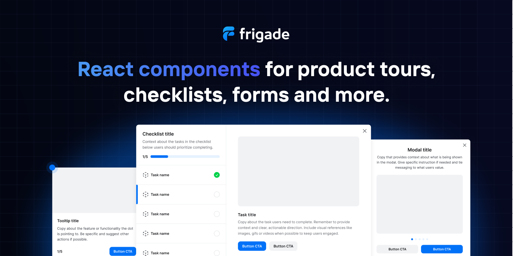

# react-tooltip

[](https://www.npmjs.org/package/react-tooltip)

[](https://github.com/prettier/prettier)
[![npm download][download-image]][download-url]


<!--  -->

[download-image]: https://img.shields.io/npm/dm/react-tooltip.svg?style=flat-square
[download-url]: https://npmjs.org/package/react-tooltip

If you like the project, please give the project a GitHub 🌟

---

Why do we show ads on our docs?

- ReactTooltip is an open source project, this is the way we found to be financed by the community.

## Demo

[](https://codesandbox.io/s/gallant-leftpad-8kvtn7?file=/src/App.js)

Documentation for V4 - [Github Page](https://reacttooltip.github.io/react-tooltip/).

Documentation for V5 - [ReactTooltip](https://react-tooltip.com/docs/getting-started).

---

## Installation

```sh
npm install react-tooltip
```

or

```sh
yarn add react-tooltip
```

## Sponsors

### Gold Sponsors 🌟

<a href="https://frigade.com/?source=react-tooltip">
  
</a>

React Tooltip is proud to be sponsored by [Frigade](https://frigade.com/?source=react-tooltip), a developer tool for building better product onboarding: guided tours, getting started checklists, announcements, etc.

#### Silver Sponsors ✪

<!-- <a href="#">
  
</a> -->

## Powered by

<p>
  <a href="https://www.digitalocean.com/?refcode=0813b3be1161&utm_campaign=Referral_Invite&utm_medium=Referral_Program&utm_source=badge">
    
  </a>
</p>

## Usage

1 . Import the CSS file to set default styling.

> [!WARNING]\
> If you are using a version before than `v5.13.0`, you must import the CSS file or the tooltip won't show!

```js
import 'react-tooltip/dist/react-tooltip.css'
```

This needs to be done only once and only if you are using a version before than `5.13.0`. We suggest you do it on your `src/index.js` or equivalent file.

2 . Import `react-tooltip` after installation.

```js
import { Tooltip } from 'react-tooltip'
```

or if you want to still use the name ReactTooltip as V4:

```js
import { Tooltip as ReactTooltip } from 'react-tooltip'
```

3 . Add `data-tooltip-id="<tooltip id>"` and `data-tooltip-content="<your placeholder>"` to your element.

> `data-tooltip-id` is the equivalent of V4's `data-for`.

```jsx
<a data-tooltip-id="my-tooltip" data-tooltip-content="Hello world!">
  ◕‿‿◕
</a>
```

4 . Include the `<Tooltip />` element.

> [!NOTE]\
> Don't forget to set the id, it won't work without it!

```jsx
<Tooltip id="my-tooltip" />
```

## Troubleshooting

Before trying these, make sure you're running the latest ReactTooltip version with

```sh
npm install react-tooltip@latest
```

or

```sh
yarn add react-tooltip@latest
```

Please check our [troubleshooting section](https://react-tooltip.com/docs/troubleshooting) on our docs.

If you can't find your problem here, make sure there isn't [an open issue](https://github.com/ReactTooltip/react-tooltip/issues) already covering it.
If there isn't, feel free to [submit a new issue](https://github.com/ReactTooltip/react-tooltip/issues/new/choose).

## Article

[How I insert sass into react component](https://medium.com/@wwayne_me/how-i-insert-sass-into-my-npm-react-component-b46b9811c226#.gi4hxu44a)

## Maintainers

[danielbarion](https://github.com/danielbarion) Maintainer - Creator of React Tooltip >= V5.

[gabrieljablonski](https://github.com/gabrieljablonski) Maintainer.

[aronhelser](https://github.com/aronhelser) (inactive).

[alexgurr](https://github.com/alexgurr) (inactive).

[pdeszynski](https://github.com/pdeszynski) (inactive).

[roggervalf](https://github.com/roggervalf) (inactive).

[huumanoid](https://github.com/huumanoid) (inactive)

[wwayne](https://github.com/wwayne) (inactive) - Creator of the original React Tooltip (V1.x ~ V4.x.)

We would gladly accept a new maintainer to help out!

## Contributing

We welcome your contribution! Fork the repo, make some changes, submit a pull-request! Our [contributing](CONTRIBUTION.md) doc has some details.

## License

MIT
